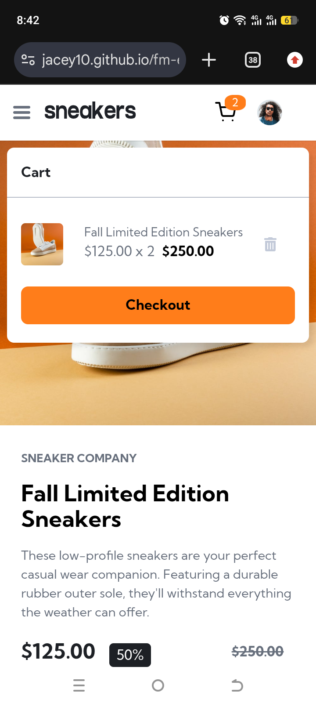
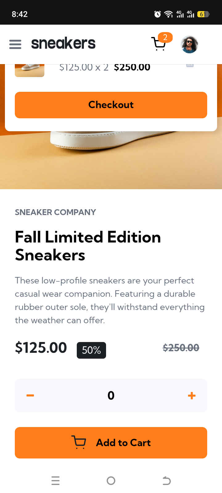

# Frontend Mentor - E-commerce product page solution

This is a solution to the [E-commerce product page challenge on Frontend Mentor](https://www.frontendmentor.io/challenges/ecommerce-product-page-UPsZ9MJp6). Frontend Mentor challenges help you improve your coding skills by building realistic projects.

## Table of contents

- [Overview](#overview)
  - [The challenge](#the-challenge)
  - [Screenshot](#screenshot)
  - [Links](#links)
- [My process](#my-process)
  - [Built with](#built-with)
  - [What I learned](#what-i-learned)
  - [Continued development](#continued-development)
  - [AI Collaboration](#ai-collaboration)
- [Author](#author)

## Overview

### The challenge

Users should be able to:

- View the optimal layout for the site depending on their device's screen size
- See hover states for all interactive elements on the page
- Open a lightbox gallery by clicking on the large product image
- Switch the large product image by clicking on the small thumbnail images
- Add items to the cart
- View the cart and remove items from it

### Screenshot

### Links

- Solution URL: (https://github.com/jacey10/fm-ecommerce-product-page-challenge)
- Live Site URL: (https://jacey10.github.io/fm-ecommerce-product-page-challenge/)

## My process

### Built with

- Semantic HTML5 markup
- CSS custom properties
- Flexbox
- CSS Grid
- Mobile-first workflow

### What I learned

* How to structure UI updates around application state instead of scattered DOM mutations.
* The importance of separating rendering responsibilities into focused functions.
* How cart rendering, badge updates, and modal state can be coordinated through a single source of truth.
* How classList.toggle() can be used to synchronize visual UI state.
* How to debug DOM reference issues and undefined errors effectively.
* How getBoundingClientRect() can be used for precise geometry-based positioning of floating UI elements.
* he difference between layout-based positioning and viewport-based positioning.
* How popovers and modals can create overflow issues when transforms and positioning are not handled carefully.
* How ARIA attributes such as aria-expanded, aria-hidden, and aria-controls should reflect UI state changes.
* he difference between accessibility attributes and full interaction accessibility patterns.
* How responsive UI systems may require different interaction logic between mobile and desktop layouts.
* How frontend architecture decisions affect scalability, maintainability, and accessibility.

### Continued development

* Strengthen accessibility further with keyboard navigation, Escape key handling, and focus management for dialogs and overlays.
* Improve component-level state management to reduce reliance on global UI classes.
* Refactor overlay and modal systems into reusable UI utilities/components.
* Add viewport edge detection and adaptive positioning for popovers and dropdowns.
* Persist cart state using local storage or backend integration.
* Expand the cart system into a complete checkout and order flow.
* Improve responsive behavior and animation consistency across devices.
* Continue practicing scalable frontend architecture and state-driven rendering patterns.
* Explore reusable rendering patterns inspired by component-based frameworks like React.
* Optimize DOM updates and event handling for cleaner, more maintainable code.

### AI Collaboration

* Used ChatGPT to debug cart rendering and modal visibility issues.
* Refactored cart logic into smaller rendering functions (`renderCartItems`, cart badge rendering, cart state updates).
* Improved state-driven UI rendering instead of scattered DOM mutations.
* Debugged `undefined` errors related to cart badge updates and DOM element references.
* Implemented dynamic cart badge visibility based on cart quantity.
* Fixed desktop cart modal positioning using `getBoundingClientRect()` for geometry-based placement.
* Solved cart modal overflow and animation issues with improved popover behavior.
* Worked through responsive modal positioning for both mobile and desktop layouts.
* Improved accessibility by synchronizing UI state with ARIA attributes (`aria-expanded`, `aria-hidden`, `aria-controls`).
* Discussed scalable UI state management patterns for overlays, modals, and backdrops.
* Explored accessibility considerations for dialogs, overlays, and interactive UI components.
* Reviewed architectural trade-offs between shared UI layers vs isolated component systems.

## Author

- Website - [Jacey Blog](https://www.jacey.hashnode.dev/)
- Frontend Mentor - [@jacey10](https://www.frontendmentor.io/profile/jacey10)
- Twitter - [@jacey_muna](https://x.com/jacey_muna)

